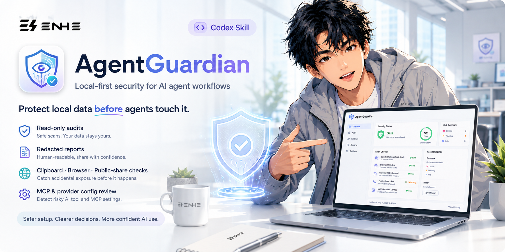

[中文版](README.md)

# AgentGuardian

Local-first data security auditing for AI agent workflows. AgentGuardian helps users inspect local configuration, browser data, clipboard content, and public-share exposure before an AI agent handles that data.

> Current channel: Windows 11 x64 · 0.3.0 Public Preview · unsigned

## 1. What is this repository?

This is the public source repository and download guide for the AgentGuardian Windows Public Preview.

The product uses one local audit core with three entry points:

- Desktop GUI for selecting a scope, reviewing the consent summary, and reading reports on Windows.
- Standalone Codex Skill for checking local MCP availability, collecting consent, and calling the configured local tools.
- Local STDIO MCP proxy so Codex and other MCP-capable hosts can call AgentGuardian on the same machine.

All three entry points share the same data-access boundary. Audits are limited to a scope explicitly selected by the user, are primarily read-only, and require human confirmation before the operation reads or verifies data.

## 2. Who is it for?

### 1. Especially suitable

- Individuals using Codex or another AI agent on Windows 11 x64 who want a check before an agent touches local data.
- Creators, developers, and AI Builders working with personal, non-regulated AI configuration, workflow files, browser metadata, or temporary clipboard content.
- Users who want to choose between the GUI, an independent Skill package, and a local STDIO MCP entry point.
- People who need readable, redacted reports as an aid for human review.

### 2. Not suitable

- Medical, financial, identity, biometric, legally privileged, customer, national-secret, regulated, or other highly sensitive real data.
- Organizations that require an enterprise console, centralized policy control, dynamic MCP sandboxing, automatic remediation, telemetry, or a background service.
- Scenarios that require verified code signing, a formal signing identity, compliance certification, or a production-safety commitment.
- Treating an audit result as proof that a system, account, agent, or dataset is absolutely safe.

## 3. What does it produce?

- Redacted JSON and HTML audit reports generated under the current rules.
- Findings organized by scope, severity, explainable score, and manual disposition guidance.
- A consent summary shown before execution and scope summary information for review.
- Bounded results for files, browser data, clipboard content, or a public URL, with uncovered, truncated, and human-review items identified.

Reports are decision-support material, not a security certification, legal opinion, or compliance attestation.

## 4. What value does it provide?

- Adds a clear local inspection and human-confirmation step before an agent reads data.
- Keeps the GUI, Codex Skill, and STDIO MCP aligned to one audit boundary.
- Turns local findings into reports that are easier to read and review.
- Provides local adaptation, detection, and manual guidance for OpenAI Provider configuration; no Provider API is called by default.
- Shows what the audit covered, what it did not cover, and where a human must decide.

## 5. Usage Results

## 6. Installation

[Download the Windows x64 single-file installer](https://github.com/yangjing6213-dev/AgentGuardian/releases/latest/download/AgentGuardian-Setup-Windows-x64.exe)

This is the unsigned AgentGuardian 0.3.0 Public Preview installer. It targets personal, non-regulated configuration data on Windows 11 x64. Windows may display an Unknown Publisher or SmartScreen warning.

Before running it, download and compare the corresponding hash in [SHA256SUMS](https://github.com/yangjing6213-dev/AgentGuardian/releases/latest/download/SHA256SUMS):

1. Download the single-file EXE above.
2. Calculate its SHA-256 hash with a Windows file-hash tool and compare it with SHA256SUMS.
3. Confirm the source and hash before running the file. Open-source availability does not remove Windows publisher warnings.
4. In the installer, select the components you need. The installer provides the desktop GUI and can install the independent Codex Skill, enable local MCP, and create a desktop shortcut.
5. After installation, confirm that the local MCP tools are visible in the target host before starting an audit.

Other downloads:

- [View the 0.3.0 Public Preview](https://github.com/yangjing6213-dev/AgentGuardian/releases/tag/v0.3.0-preview.1)
- [Windows x64 portable ZIP](https://github.com/yangjing6213-dev/AgentGuardian/releases/latest/download/AgentGuardian-0.3.0-preview.1-windows-x64.zip)
- [Versioned Windows x64 installer](https://github.com/yangjing6213-dev/AgentGuardian/releases/latest/download/AgentGuardian-Setup-0.3.0-preview.1-x64.exe)
- [Independent AgentGuardian Skill ZIP](https://github.com/yangjing6213-dev/AgentGuardian/releases/latest/download/AgentGuardian-Skill-0.2.0.zip)
- [Download metadata](https://github.com/yangjing6213-dev/AgentGuardian/releases/latest/download/DOWNLOAD-METADATA.json)
- [Third-party notices](https://github.com/yangjing6213-dev/AgentGuardian/releases/latest/download/THIRD_PARTY_NOTICES.md)

The installer uses a per-user directory and does not require administrator privileges. The host may still require explicit user confirmation for Skill or MCP configuration. AgentGuardian does not silently download a Provider, an MCP adapter, or another remote component.

## 7. How to Use

### Desktop GUI

1. Launch AgentGuardian.
2. Choose one operation and the smallest necessary scope: files, browser, clipboard, or public_share.
3. Review the consent summary and classify the data as personal_non_regulated.
4. Confirm the operation as a human, then run the audit.
5. Review the redacted report and decide on any follow-up manually.

### Codex Skill

1. Download the independent Skill ZIP from the Release, or select the Skill option in the installer.
2. Install it at the location expected by the host, for example %USERPROFILE%\.agents\skills\agentguardian.
3. Ask the host to check for both local MCP tools: prepare_audit and run_prepared_audit.
4. Follow the Skill prompts to select one operation, confirm its scope, and decide whether to continue at the host approval prompt.

The Skill does not replace the local runtime, edit host configuration by itself, or use Shell, browser, or network tools as a substitute for the MCP capability check.

### Local STDIO MCP proxy

For a host that supports local STDIO MCP, configure the console helper as:

~~~text
AgentGuardianMcp.exe --stdio-mcp
~~~

The host should then expose:

- prepare_audit
- run_prepared_audit

Call prepare_audit first to review the scope and consent summary. After explicit human confirmation, call run_prepared_audit. Do not use the windowed GUI executable as the STDIO command, and do not convert the local proxy into a remote URL.

The three entry points have the same data-access capability, but every audit remains limited by the selected scope and the user's confirmation.

## 8. Project Workflow

1. Select one operation and the smallest necessary scope, and confirm that the data is personal and non-regulated.
2. Run the preflight checks for the path, operation, and host capabilities.
3. Show the consent summary and explain which redacted arguments and results may enter the host model context.
4. After the user chooses to continue, run the local read-only audit or public-URL reachability check.
5. Generate a redacted JSON/HTML report with findings, coverage boundaries, and truncation details.
6. A human reviews the report and decides whether to adjust configuration manually.

Browser checks use a temporary local copy. Clipboard checks read the current value only when explicitly requested. public_share checks only a public URL explicitly supplied by the user and do not upload audit data through that operation. The project does not perform automatic remediation, maintain a background listener, or dynamically load and execute arbitrary MCP plugins.

## 9. Project Directory Structure

~~~text
src/agentguardian/       Local audit core, reporting, Provider guidance, and MCP service
skills/agentguardian/    Independent Codex Skill
packaging/windows/       Windows portable, PyInstaller, and Inno Setup configuration
release_profiles/        Public Preview release profiles and boundaries
scripts/                 Build, validation, packaging, and evidence scripts
tests/                   Unit, integration, and Windows packaging tests
docs/                    Architecture, security, release, and development records
assets/brand/            README, brand, and author presentation assets
.github/workflows/       GitHub CI and Windows workflows
~~~

## 10. Important Notes

- This is an unsigned Windows 11 x64 Public Preview, not a production-safety release.
- Use it only with personal, non-regulated configuration data. Do not use highly sensitive real data. This restriction is not a promise that AgentGuardian can classify every piece of content correctly.
- Do not treat a report as proof of security, privacy, compliance, or enterprise control. The current preview does not provide an enterprise console, dynamic MCP sandbox, automatic remediation, telemetry, background service, or a general security guarantee.
- The OpenAI Provider path performs local adaptation, detection, and manual guidance only. It does not call OpenAI or another Provider API by default.
- Redacted arguments and results passed by the Skill may enter the host model context. Incomplete permissions, incomplete coverage, or truncated results cannot establish safety.
- The static MCP detector analyzes configuration risk; it does not download, start, broker, or execute MCP software.
- Verify SHA-256 before running an installer. Do not run an artifact whose hash cannot be checked.
- Source code is under Apache License 2.0. See [THIRD_PARTY_NOTICES.md](THIRD_PARTY_NOTICES.md) for component and redistribution notices. The corresponding Release notes remain authoritative for the unsigned status and preview boundary.

### Preview Status and Release Markers

The following markers match the repository release profile. They describe preview maturity and gate status; they do not make the public download link unavailable:

- 0.3 Integrations Preview is the active development track.
- The maturity marker is INTEGRATIONS-PREVIEW-NOT-READY.
- NO-GO means that production safety and formal security delivery are not claimed; it does not mean that the Release page is inaccessible.
- This is an unsigned Public Preview.
- The supported boundary is personal non-regulated configuration; high-sensitivity real data is unsupported.
- production-safety: not claimed; enterprise control-plane: unsupported.
- The runtime must not call OpenAI or another Provider API by default.
- AgentGuardian does not silently download or enable a Provider API.
- The primary installer is AgentGuardian-Setup-Windows-x64.exe; the local proxy is AgentGuardianMcp.exe; the installer includes an independent Skill payload.
- The frozen exact SHA record for 0.2.0-beta.1 is historical evidence only and does not prove the current version.

Development governance and historical evidence

The governance files below govern development; they are not product capability claims or release evidence:

- [Approved active product specification](docs/superpowers/specs/2026-08-16-agentguardian-personal-v1-design.md)
- [Active implementation plan](docs/superpowers/plans/2026-08-21-agentguardian-personal-exe-private-beta.md)
- [Canonical partial status ledger](docs/security/personal-exe-private-beta-status.json)
- The frozen private-beta candidate 8ad46e31486d05a2b4572ef8bd7442eb22a7b5b6 remains PRIVATE-BETA-NOT-READY; formal public release remains `NO-GO` because external license and Qt approval, two-machine acceptance, and operations/security gates are pending.
- Older Windows MVP reports are historical planning or evidence snapshots.

The current Release has these eight public asset names:

~~~text
AgentGuardian-0.3.0-preview.1-windows-x64.zip
AgentGuardian-Setup-0.3.0-preview.1-x64.exe
AgentGuardian-Setup-Windows-x64.exe
AgentGuardian-Skill-0.2.0.zip
DOWNLOAD-METADATA.json
LICENSE
SHA256SUMS
THIRD_PARTY_NOTICES.md
~~~

### Preview Status and Release Markers

The following markers match the repository release profile. They describe preview maturity and gate status; they do not make the public download link unavailable:

- 0.3 Integrations Preview is the active development track.
- The maturity marker is INTEGRATIONS-PREVIEW-NOT-READY.
- NO-GO means that production safety and formal security delivery are not claimed; it does not mean that the Release page is inaccessible.
- This is an unsigned Public Preview.
- The supported boundary is personal non-regulated configuration; high-sensitivity real data is unsupported.
- production-safety: not claimed; enterprise control-plane: unsupported.
- The runtime must not call OpenAI or another Provider API by default.
- AgentGuardian does not silently download or enable a Provider API.
- The primary installer is AgentGuardian-Setup-Windows-x64.exe; the local proxy is AgentGuardianMcp.exe; the installer includes an independent Skill payload.
- The frozen exact SHA record for 0.2.0-beta.1 is historical evidence only and does not prove the current version.

The current Release has these eight public asset names:

~~~text
AgentGuardian-0.3.0-preview.1-windows-x64.zip
AgentGuardian-Setup-0.3.0-preview.1-x64.exe
AgentGuardian-Setup-Windows-x64.exe
AgentGuardian-Skill-0.2.0.zip
DOWNLOAD-METADATA.json
LICENSE
SHA256SUMS
THIRD_PARTY_NOTICES.md
~~~

## 11. Related Projects

None

## 12. About the Author

**Enhe (恩禾) - Product Designer - One-Person Company Practitioner - AI Builder**

Building one-person companies with AI.

- GitHub: [yangjing6213-dev](https://github.com/yangjing6213-dev)
- X/Twitter: [Amenenhe_ai](https://x.com/Amenenhe_ai)
- Website: [www.enhe-tech.com.cn](https://www.enhe-tech.com.cn/)
- WeChat: Hu-Amen
- Email: [amen.enhe@gmail.com](mailto:amen.enhe@gmail.com)

## 13. Continue Exploring

AgentGuardian is one tool in my AI-built personal generation system. If you are using AI for content, knowledge bases, workflows, or productization, visit [www.enhe-tech.com.cn](https://www.enhe-tech.com.cn/) to explore more.

---

Source license: [Apache License 2.0](LICENSE).
