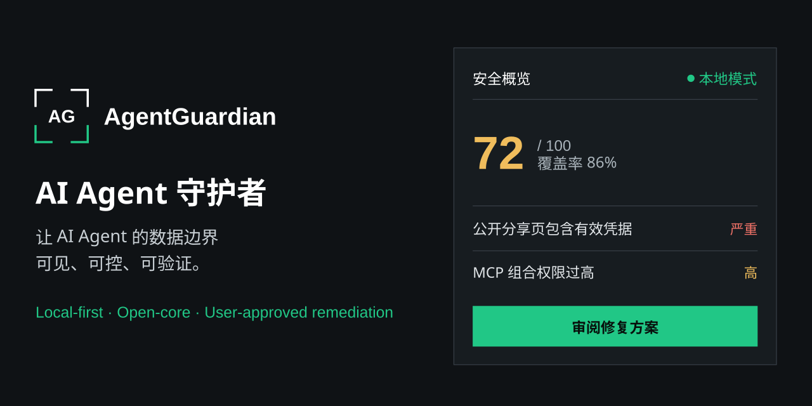

# AgentGuardian Personal v1

AgentGuardian Personal v1 is a local-first static security auditor for Windows 11 x64. Its supported use boundary is **personal non-regulated configuration**. The only active delivery and governance route is the unsigned `personal_exe_private_beta` track for known testers. Version `0.2.0-beta.1` is `PRIVATE-BETA-NOT-READY` because no real installer EXE, successful native workflow execution evidence, or two-machine acceptance evidence exists; formal public release remains `NO-GO`.

## Current implementation

- Static audit of directories explicitly selected by the user, with bounded read-only discovery.
- Redacted JSON and HTML reports with explainable scoring, findings, and disposition guidance.
- Read-only browser SQLite metadata audit through a temporary local copy that is cleaned up after use.
- One-time, explicitly triggered clipboard inspection in memory; clipboard source text is not retained.
- Explicit public URL share-reachability checks. AgentGuardian does not upload audit data through this action.
- One fixed, allowlisted `OPENAI_BASE_URL_OVERRIDE` replacement with preview, confirmation, target recheck, backup, and same-session rollback.
- Local state protected for the current Windows user with DPAPI.
- Static MCP configuration detection for dangerous capability combinations.
- OpenAI Provider local adaptation, detection, and manual guidance only. The runtime must not call OpenAI or another provider API by default.

`Personal v1 不支持高敏感现实数据`。`联网分享验证仅在用户显式输入公开 URL 后执行`。

## Permanently excluded

Personal v1 permanently excludes MCP runtime integration. Enterprise features, a high-sensitivity mode, and dynamic MCP execution are not product roadmap promises. The runtime has no telemetry, cloud console, automatic arbitrary remediation, or plugin execution.

The static MCP detector does not download, load, launch, broker, sandbox, package, or execute MCP software. Provider findings are local configuration observations and manual guidance, not endpoint classification or API verification.

## Unsupported real data

Do not use Personal v1 with medical, financial, identity or biometric, legally privileged, customer data, state-secret, other regulated, or other high-sensitivity real data. This boundary is a use restriction, not a guarantee that AgentGuardian can classify content correctly.

## Not yet passed

The intended delivery route is a traditional unsigned offline EXE installer sent directly to known private testers. No installer candidate has passed the required gates. Because it is unsigned, Windows may show Unknown Publisher or SmartScreen warnings; testers must verify the supplied SHA-256 before running it.

An artifact uploaded by this public repository's GitHub Actions workflow is not an access-controlled private distribution channel. `Private beta` is a maturity label for the known-tester scope, not a claim that an artifact is confidential or access-restricted.

The pinned installer-tool download, external license and Qt review, exact installer build, two independent clean-machine install/run/uninstall checks, independent final review, and the operations/security gate remain pending. GitHub Issues is live for ordinary support. GitHub Private Vulnerability Reporting is disabled, so no current private vulnerability intake is claimed. These limits prohibit production-safety, installer acceptance, license, or clean-machine claims.

The canonical gate template is [personal-exe-private-beta-status.json](docs/security/personal-exe-private-beta-status.json). Private beta remains `PRIVATE-BETA-NOT-READY` and formal release remains `NO-GO`; exact-SHA evidence must be generated outside the candidate commit.

## Try from source

Use Windows 11 x64 and Python 3.12 or later. Run with ordinary user privileges and only synthetic or supported personal non-regulated configuration data.

```powershell
py -3.12 -m venv .venv
.\.venv\Scripts\python -m pip install -e .
.\.venv\Scripts\python -m agentguardian
```

Developer verification:

```powershell
.\.venv\Scripts\python -m pip install -r requirements-dev.lock --require-hashes
.\.venv\Scripts\python -m pytest -q -p no:cacheprovider
```

The self-audit reports the Python 版本 but does not expose the interpreter path.

## Active product documents

- [Architecture](docs/architecture.md)
- [Threat model](docs/security/personal-v1-threat-model.md)
- [Privacy](docs/security/personal-v1-privacy.md)
- [Support and vulnerability handling](docs/security/personal-v1-support.md)
- [Release gate runbook](docs/security/personal-v1-release-runbook.md)
- [Independent-machine acceptance](docs/security/personal-v1-independent-machine-acceptance.md)

## Development governance

- [Approved Personal v1 specification](docs/superpowers/specs/2026-08-16-agentguardian-personal-v1-design.md)
- [Active Personal EXE private-beta implementation plan](docs/superpowers/plans/2026-08-21-agentguardian-personal-exe-private-beta.md)

The approved specification and active implementation plan govern development; they are not product capability claims or release evidence. The Store/MSIX/WACK/Partner Center route and its artifacts are historical and non-governing. Retiring or deleting that route does not pass any private-beta gate. Other documents under `docs/superpowers` are historical planning snapshots; older Windows MVP reports are historical planning or evidence snapshots. `docs/security/windows-mvp-threat-model.md` and `docs/security/windows-release-evidence.md` are also historical snapshots. They are not active Personal v1 product promises or current release evidence.

## License

Source code is licensed under [Apache License 2.0](LICENSE). That repository license does not replace the pending external review of the exact candidate SBOM, Qt, and redistribution obligations.
