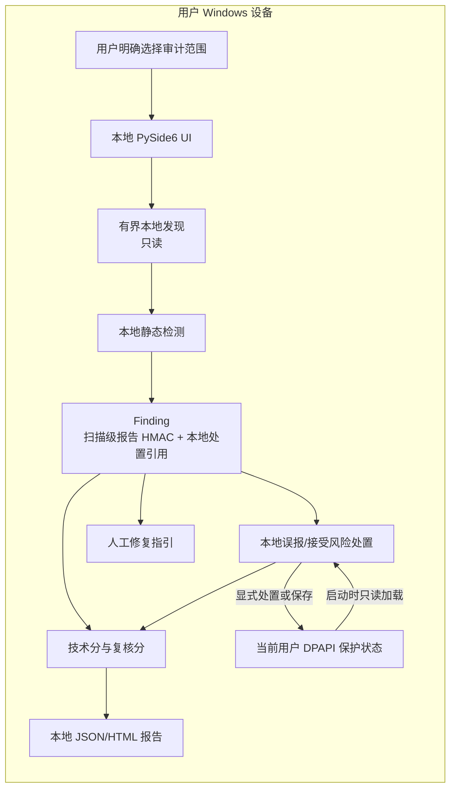

# AgentGuardian 系统架构与数据流

本文档描述 Founder Alpha 的安全边界和组件契约。实现必须保持这些边界；后续扩展可以增加适配器，但不能把原始证据默认移出本机。

## 当前 Founder Alpha 已实现数据流



## 当前权限边界

1. UI、本地发现、静态检测、评分和报告生成默认以普通用户权限运行。
2. 发现范围由用户明确选择并保持只读；扫描器没有任意命令执行能力。
3. 报告只在用户明确选择的本地位置新建，不覆盖已有文件。
4. DPAPI 状态在启动时只读加载；只有显式保存或处置动作才写入固定本地状态文件。
5. 当前包源码边界不包含网络、LLM、遥测、更新器、剪贴板、动态插件或自动修复能力。

## 未来目标（未实现）

当前实现不包含隔离扫描插件、限权修复代理、独立复审器、签名更新器或外部解释服务。这些组件仅是后续目标，不属于 Founder Alpha 当前数据流，也不能用于声称当前已有更新、外发、自动修复或独立验证能力。动态 MCP 测试同样待后续隔离沙箱设计。

路径、权限范围、动作 ID、前置条件、预览、批准、回滚和通过/失败复审字段均为未来未实现设想，不属于当前 `domain.py` 数据类。

## 组件契约

以下 JSON 是 `domain.py` 当前数据类的精确字段顺序，供文档测试与源码机械比对：

<!-- domain-field-inventory -->
```json
{
  "Asset": ["asset_id", "kind", "display_name"],
  "Evidence": ["source", "fingerprint", "masked"],
  "Finding": [
    "rule_id",
    "domain",
    "severity",
    "root_fingerprint",
    "evidence",
    "disposition_ref"
  ],
  "Score": [
    "total",
    "deductions",
    "cap_reason",
    "coverage",
    "confidence",
    "limits",
    "incomplete"
  ],
  "RemediationPlan": [
    "rule_id",
    "asset_ref",
    "mode",
    "steps",
    "verification_steps"
  ],
  "VerificationResult": ["status", "notes"]
}
```

- `Asset` 只包含 `asset_id`、`kind`、`display_name`；`asset_id` 是不透明 HMAC 引用，`display_name` 是短显示名而非路径。
- `Evidence` 只包含 `source`、`fingerprint`、`masked`；来源保持短显示名，指纹为 HMAC，证据文本必须脱敏。
- `Finding` 只包含 `rule_id`、`domain`、`severity`、`root_fingerprint`、`evidence`、`disposition_ref`。`disposition_ref` 是 `repr=False` 的本地处置引用，不进入导出报告，只用于受保护状态中的跨扫描精确匹配。
- `Score` 只包含 `total`、`deductions`、`cap_reason`、`coverage`、`confidence`、`limits`、`incomplete`。
- `RemediationPlan` 只包含 `rule_id`、`asset_ref`、`mode`、`steps`、`verification_steps`。`RemediationPlan` 当前没有 `title` 字段；`mode` 固定为 `manual`，`RemediationPlan` 只承载人工指引，不执行动作。
- `VerificationResult` 只包含 `status` 和 `notes`；`VerificationResult.status` 固定为 `not_performed`，不表示通过/失败复审记录。

## Windows MVP Batch 2 证据状态

当前实现把证据状态拆为三个边界：`evidence_state.py` 只生成和验证确定性的最小 JSON；`windows_dpapi.py` 只执行当前 Windows 用户范围 DPAPI bytes 保护；`state_store.py` 只负责固定文件名、大小上限、reparse 检查、同目录临时文件和原子替换。UI 不在启动或扫描后自动调用存储层，只有用户点击“保存加密状态”才会写入。

状态只包含规则 ID、固定规则摘要、扫描元数据和扫描级 HMAC 引用，不复制 detector 自由文本，不保存原始匹配、扫描密钥、完整路径或证据来源文件名。未知规则没有固定摘要时失败关闭。密文内部使用版本标记和 SHA-256 完整性封装；DPAPI 解密、完整性、JSON、schema、未知字段、HMAC、摘要或大小验证任一失败，整个读取返回固定 `PROTECTED_STATE_INVALID`，不返回部分状态或底层错误。

存储层拒绝任一现存祖先中的 reparse/junction，并在解析后重查 UNC。路径检查与最终 `os.replace` 之间仍有同用户竞态窗口；当前实现没有 Windows 句柄级目录约束。该状态不发起 API 调用，也不提供云同步、自动修复、跨用户或跨设备恢复。DPAPI 不能抵御已经控制同一 Windows 用户会话的程序；Python 也不保证安全清零所有不可变 bytes 副本。扫描级 HMAC 使用每次扫描的新密钥，不能作为跨扫描稳定身份。这一增量不代表 Windows MVP 完成或生产安全。

## Windows MVP Batch 3 发现处置

Batch 3 为每个 finding 计算一个不导出的 `disposition_ref`。精确跨扫描消息由长度分隔的规则 ID、按 Windows 词法规则规范化的源路径，以及 NFKC 规范化的原始匹配组成；路径明确使用 `ntpath.abspath`、`ntpath.normpath` 和 `ntpath.normcase`，不做 NFKC。相同规则、相同 Windows 词法路径和相同规范化原始匹配才共享处置；规则、路径、原始匹配或本地密钥任一变化都会重新打开发现。

本地处置 HMAC 密钥与每次扫描随机生成的报告 HMAC 密钥彼此独立。报告 HMAC 仍限定于单次扫描；本地密钥和 `disposition_ref` 只存在于当前 Windows 用户 DPAPI 保护状态中，不进入 JSON、HTML、界面、日志或异常。处置有效期必须有限且不超过 366 天。有效误报只从复核分排除；接受风险仍计入复核分；技术分不受处置影响。过期、未来创建、规则不匹配或引用不匹配的记录都不能关闭 finding。

保护状态 schema v1 只读兼容，只有显式保存才迁移到 schema v2；启动不会重写。损坏、不可解密或无效的受保护状态必须先获得明确确认，才允许替换。处置创建、替换和撤回都先原子保存候选状态，再更新内存分数、表格和报告；保存失败保留原状态。

静态自审计先严格读取随包分发的 `source_policy.json` schema 1 清单，并要求包内 `.py` 模块集合与清单完全相等。每个模块先将原始 ASCII newline bytes 中的 CRLF 和 CR 确定性规范化为 LF，再以 `tokenize.detect_encoding` 按 PEP 263 编码声明解码，并对规范化 Unicode 的 UTF-8 表示计算 canonical source SHA-256；因此注释和编码 cookie 也在证明范围内。换行表示被有意忽略，UTF-8 BOM 按解码语义被消费，所以该清单不是原始字节身份的证明。未经规范化的原始 bytes 还会独立交给 `ast.parse(..., filename=...)`，保证按 Python 将执行的语法失败关闭并让 UTF-7 等编码中的运行时语法对扫描可见。未知编码、语法错误、模块增加、删除或 canonical source 变化都会产生固定 finding 并令 `local_only` 为 false。已复核包不会再由启发式解释。有限启发式仅对清单外的合成未知模块运行，用于识别代表性的网络导入、动态执行和用户数据写入能力；它不是 Python 表达式解释器，也不构成语义证明。

仓库顶层 `rules/default.json` 是规则权威来源；`src/agentguardian/rules/default.json` 是仅供安装包运行的 byte-identical 副本。测试在复制的临时源码树中直接调用已锁定的 `setuptools.build_meta.build_wheel`，不调用打包或安装前端；wheel `RECORD` 必须同时包含该规则副本和 `agentguardian/source_policy.json`，两项资源的 URL-safe base64 SHA-256 和记录的字节大小都必须与成员 bytes 匹配。wheel 再由 `zipfile` 直接解压并运行隔离探针，避免污染原工作树或依赖仓库目录布局。

该批次仅增加本地静态操作和人工指引，不发起 API 调用，也不默认访问 OpenAI API。DPAPI 不能抵御已经控制同一 Windows 用户会话的程序。主机时钟、路径别名或文件移动可能重新打开发现，但不会扩大处置范围。路径检查与 `os.replace` 之间仍有同用户竞态窗口，且没有句柄级目录绑定。Python 不能保证清除所有不可变 bytes 或字符串副本。静态自审计只覆盖已复核源码清单和有界启发式，不扫描依赖或二进制。清单未签名；同一用户控制代码和清单时可以同时替换两者，因此生产构建来源、签名和发布物证明仍属于 Batch 5。Batch 3 本地实现的自动门禁已重新通过；独立安全复审和最终 SHA 远程验收仍待完成。Batches 4-6 仍待完成，当前 Founder Alpha 仍是非生产状态。

## 后续可信性要求（未实现门禁）

- 源代码、规则、评分和修复契约开放透明。
- 发布物提供哈希、构建来源和 SBOM；正式发布前完成代码签名。
- 内置自我审计检查安装目录、权限、网络出口、更新来源、日志和完整性。
- 公开报告不得把“没有发现”表述为“绝对安全”；未授权或未扫描范围必须显式显示。
