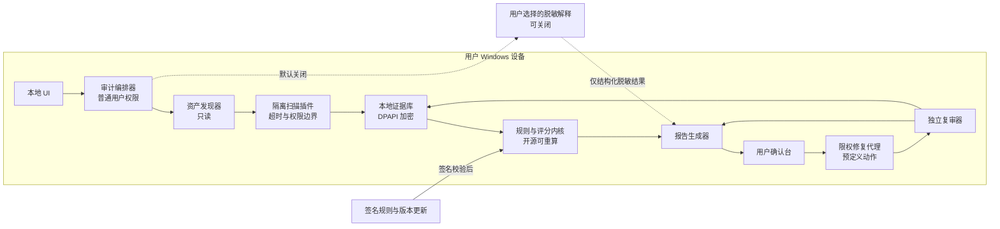

# AgentGuardian 系统架构与数据流

本文档描述 Founder Alpha 的安全边界和组件契约。实现必须保持这些边界；后续扩展可以增加适配器，但不能把原始证据默认移出本机。

## 高层数据流

## 权限边界

1. UI、编排器、规则引擎和报告生成器默认以普通用户权限运行。
2. 扫描插件按数据源隔离，拥有明确范围、超时、资源上限和错误报告，不共享任意命令执行能力。
3. 修复代理只接受签名动作目录中的声明式动作；每个动作必须有前置条件、影响预览、备份、回滚和验证器。
4. 外发通道默认关闭。规则更新、匿名统计和脱敏解释分别设置开关，并记录出口清单。
5. 动态 MCP 测试不进入 Founder Alpha；后续必须在隔离沙箱中执行。

## 组件契约

组件之间使用可版本化的结构化对象传递数据：

- `Asset`：来源类型、产品标识、版本、路径、权限、发现时间和覆盖状态。
- `Evidence`：证据位置、规则 ID、脱敏摘要、指纹、置信度、时间戳；不保存完整密钥和完整原文。
- `Finding`：风险领域、严重程度、根因指纹、影响范围、修复建议和证据引用。
- `Score`：领域分数、总分、覆盖率、置信度、封顶原因和限制项。
- `RemediationPlan`：动作 ID、前置条件、预览、批准状态、回滚点和验证方式。
- `VerificationResult`：复审时间、检查项、通过/失败、残留证据和下一步建议。

## Windows MVP Batch 2 证据状态

当前实现把证据状态拆为三个边界：`evidence_state.py` 只生成和验证确定性的最小 JSON；`windows_dpapi.py` 只执行当前 Windows 用户范围 DPAPI bytes 保护；`state_store.py` 只负责固定文件名、大小上限、reparse 检查、同目录临时文件和原子替换。UI 不在启动或扫描后自动调用存储层，只有用户点击“保存加密状态”才会写入。

状态只包含规则 ID、固定规则摘要、扫描元数据和扫描级 HMAC 引用，不复制 detector 自由文本，不保存原始匹配、扫描密钥、完整路径或证据来源文件名。未知规则没有固定摘要时失败关闭。密文内部使用版本标记和 SHA-256 完整性封装；DPAPI 解密、完整性、JSON、schema、未知字段、HMAC、摘要或大小验证任一失败，整个读取返回固定 `PROTECTED_STATE_INVALID`，不返回部分状态或底层错误。

存储层拒绝任一现存祖先中的 reparse/junction，并在解析后重查 UNC。路径检查与最终 `os.replace` 之间仍有同用户竞态窗口；当前实现没有 Windows 句柄级目录约束。该状态不发起 API 调用，也不提供云同步、自动修复、跨用户或跨设备恢复。DPAPI 不能抵御已经控制同一 Windows 用户会话的程序；Python 也不保证安全清零所有不可变 bytes 副本。扫描级 HMAC 使用每次扫描的新密钥，不能作为跨扫描稳定身份。这一增量不代表 Windows MVP 完成或生产安全。

## 可信性要求

- 源代码、规则、评分和修复契约开放透明。
- 发布物提供哈希、构建来源和 SBOM；正式发布前完成代码签名。
- 内置自我审计检查安装目录、权限、网络出口、更新来源、日志和完整性。
- 公开报告不得把“没有发现”表述为“绝对安全”；未授权或未扫描范围必须显式显示。
