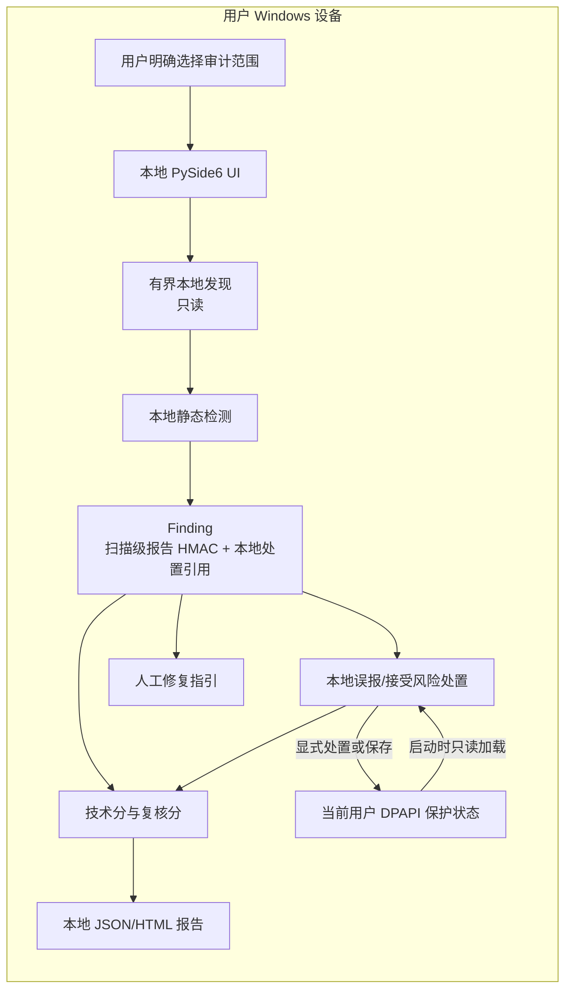

# AgentGuardian 系统架构与数据流

本文档描述 Founder Alpha 的安全边界和组件契约。实现必须保持这些边界；后续扩展可以增加适配器，但不能把原始证据默认移出本机。

## 当前 Founder Alpha 已实现数据流



## 当前权限边界

1. UI、本地发现、静态检测、评分和报告生成默认以普通用户权限运行。
2. 发现范围由用户明确选择并保持只读；每次扫描都需要与当前范围绑定的明确同意，扫描器没有任意命令执行能力。
3. 报告只在用户明确选择的本地位置新建，不覆盖已有文件。
4. DPAPI 状态在启动时只读加载；只有显式保存或处置动作才写入固定本地状态文件。
5. 默认扫描边界不包含网络、LLM、遥测、更新器、动态插件或任意命令执行；浏览器、剪贴板和分享是用户逐项触发的独立适配器，固定修复仅允许源码白名单动作。

## 当前扩展控制内核

`enterprise_policy.py` 提供离线策略准入：规范 JSON、租户/设备绑定、单调版本、有效期、角色能力白名单、操作员配置的 SHA-256 指纹、高敏感确认和动态 MCP 隔离证明门禁。该指纹不是数字签名，也不提供设备注册、策略撤销、租户隔离或管理员控制台。

`mcp_sandbox.py` 提供默认拒绝的动态适配器监督器：固定可执行文件和 argv、启动前可执行文件 SHA-256 重查、UNC/reparse 拒绝、显式确认、临时工作目录、请求/输出/运行时上限和无原始输出留存。当前 portable/MSIX full-trust 运行时没有可证明的网络拒绝和进程树隔离提供者，因此没有原生 attestation 时不会启动适配器；合成 attestation 只在单元测试中使用。

## 受控固定修复

`remediation.py` 提供固定 `replace_fixed_file` 动作和 `OPENAI_BASE_URL_OVERRIDE`
专用替换器。桌面端只允许用户从当前报告对应的审计根目录选择同名配置文件，先生成不含原文的预览，再要求二次确认；应用时重查目标 SHA-256，创建同目录备份并原子替换。旧报告立即失效，回滚只接受本次会话中仍匹配替换 SHA-256 的目标。动作之外的命令、LLM 生成文本、密钥撤销和 Provider API 均拒绝或保持人工指引。

该流程有本地单元/UI 测试，但仍需签名包、真实 Windows 权限/竞态和独立干净机器验收。

## 未来目标（未实现）

当前实现不包含隔离扫描插件、限权修复代理、独立复审器、签名更新器或外部解释服务。这些组件仅是后续目标，不属于 Founder Alpha 当前数据流，也不能用于声称当前已有更新、外发、动态 MCP 隔离或独立验证能力。

动态 MCP 的原生隔离、企业服务端身份/策略分发和独立复审字段仍是未来能力，不属于当前 `domain.py` 数据类。

## 组件契约

以下 JSON 是 `domain.py` 当前数据类的精确字段顺序，供文档测试与源码机械比对：

<!-- domain-field-inventory -->
```json
{
  "Asset": ["asset_id", "kind", "display_name"],
  "Evidence": ["source", "fingerprint", "masked"],
  "Finding": [
    "rule_id",
    "domain",
    "severity",
    "root_fingerprint",
    "evidence",
    "disposition_ref"
  ],
  "Score": [
    "total",
    "deductions",
    "cap_reason",
    "coverage",
    "confidence",
    "limits",
    "incomplete"
  ],
  "RemediationPlan": [
    "rule_id",
    "asset_ref",
    "mode",
    "steps",
    "verification_steps"
  ],
  "VerificationResult": ["status", "notes"]
}
```

- `Asset` 只包含 `asset_id`、`kind`、`display_name`；`asset_id` 是不透明 HMAC 引用，`display_name` 是短显示名而非路径。
- `Evidence` 只包含 `source`、`fingerprint`、`masked`；来源保持短显示名，指纹为 HMAC，证据文本必须脱敏。
- `Finding` 只包含 `rule_id`、`domain`、`severity`、`root_fingerprint`、`evidence`、`disposition_ref`。`disposition_ref` 是 `repr=False` 的本地处置引用，不进入导出报告，只用于受保护状态中的跨扫描精确匹配。
- `Score` 只包含 `total`、`deductions`、`cap_reason`、`coverage`、`confidence`、`limits`、`incomplete`。
- `RemediationPlan` 只包含 `rule_id`、`asset_ref`、`mode`、`steps`、`verification_steps`。`RemediationPlan` 当前没有 `title` 字段；`mode` 固定为 `manual`，`RemediationPlan` 只承载人工指引，不执行动作。
- `VerificationResult` 只包含 `status` 和 `notes`；`VerificationResult.status` 固定为 `not_performed`，不表示通过/失败复审记录。

## Windows MVP Batch 2 证据状态

当前实现把证据状态拆为三个边界：`evidence_state.py` 只生成和验证确定性的最小 JSON；`windows_dpapi.py` 只执行当前 Windows 用户范围 DPAPI bytes 保护；`state_store.py` 只负责固定文件名、大小上限、reparse 检查、同目录临时文件和原子替换。UI 不在启动或扫描后自动调用存储层，只有用户点击“保存加密状态”才会写入。

状态只包含规则 ID、固定规则摘要、扫描元数据和扫描级 HMAC 引用，不复制 detector 自由文本，不保存原始匹配、扫描密钥、完整路径或证据来源文件名。未知规则没有固定摘要时失败关闭。密文内部使用版本标记和 SHA-256 完整性封装；DPAPI 解密、完整性、JSON、schema、未知字段、HMAC、摘要或大小验证任一失败，整个读取返回固定 `PROTECTED_STATE_INVALID`，不返回部分状态或底层错误。

存储层拒绝任一现存祖先中的 reparse/junction，并在解析后重查 UNC。路径检查与最终 `os.replace` 之间仍有同用户竞态窗口；当前实现没有 Windows 句柄级目录约束。该状态不发起 API 调用，也不提供云同步、自动修复、跨用户或跨设备恢复。DPAPI 不能抵御已经控制同一 Windows 用户会话的程序；Python 也不保证安全清零所有不可变 bytes 副本。扫描级 HMAC 使用每次扫描的新密钥，不能作为跨扫描稳定身份。这一增量不代表 Windows MVP 完成或生产安全。

## Windows MVP Batch 3 发现处置

Batch 3 为每个 finding 计算一个不导出的 `disposition_ref`。精确跨扫描消息由长度分隔的规则 ID、按 Windows 词法规则规范化的源路径，以及 NFKC 规范化的原始匹配组成；路径明确使用 `ntpath.abspath`、`ntpath.normpath` 和 `ntpath.normcase`，不做 NFKC。相同规则、相同 Windows 词法路径和相同规范化原始匹配才共享处置；规则、路径、原始匹配或本地密钥任一变化都会重新打开发现。

本地处置 HMAC 密钥与每次扫描随机生成的报告 HMAC 密钥彼此独立。报告 HMAC 仍限定于单次扫描；本地密钥和 `disposition_ref` 只存在于当前 Windows 用户 DPAPI 保护状态中，不进入 JSON、HTML、界面、日志或异常。处置有效期必须有限且不超过 366 天。有效误报只从复核分排除；接受风险仍计入复核分；技术分不受处置影响。过期、未来创建、规则不匹配或引用不匹配的记录都不能关闭 finding。

保护状态 schema v1 只读兼容，只有显式保存才迁移到 schema v2；启动不会重写。损坏、不可解密或无效的受保护状态必须先获得明确确认，才允许替换。处置创建、替换和撤回都先原子保存候选状态，再更新内存分数、表格和报告；保存失败保留原状态。

静态自审计先严格读取随包分发的 `source_policy.json` schema 1 清单，并要求包内 `.py` 模块集合与清单完全相等。每个模块先将原始 ASCII newline bytes 中的 CRLF 和 CR 确定性规范化为 LF，再以 `tokenize.detect_encoding` 按 PEP 263 编码声明解码，并对规范化 Unicode 的 UTF-8 表示计算 canonical source SHA-256；因此注释和编码 cookie 也在证明范围内。换行表示被有意忽略，UTF-8 BOM 按解码语义被消费，所以该清单不是原始字节身份的证明。未经规范化的原始 bytes 还会独立交给 `ast.parse(..., filename=...)`，保证按 Python 将执行的语法失败关闭并让 UTF-7 等编码中的运行时语法对扫描可见。未知编码、语法错误、模块增加、删除或 canonical source 变化都会产生固定 finding 并令 `local_only` 为 false。已复核包默认不再由启发式解释，但显式登记的 `share_verification.py` 仍会做网络导入能力审计，因此当前包会报告 `NETWORK_MODULE_IMPORT` 和 `local_only=false`。有限启发式仅对清单外的合成未知模块运行，用于识别代表性的网络导入、动态执行和用户数据写入能力；它不是 Python 表达式解释器，也不构成语义证明。

仓库顶层 `rules/default.json` 是规则权威来源；`src/agentguardian/rules/default.json` 是仅供安装包运行的 byte-identical 副本。测试在复制的临时源码树中直接调用已锁定的 `setuptools.build_meta.build_wheel`，不调用打包或安装前端；wheel `RECORD` 必须同时包含该规则副本和 `agentguardian/source_policy.json`，两项资源的 URL-safe base64 SHA-256 和记录的字节大小都必须与成员 bytes 匹配。wheel 再由 `zipfile` 直接解压并运行隔离探针，避免污染原工作树或依赖仓库目录布局。

OpenAI Provider 适配批次仅增加本地静态操作和人工指引，不发起 API 调用，也不默认访问 OpenAI API。当前另有用户显式触发的联网分享验证，以及固定动作白名单的受控修复内核；前者不发送本地审计数据，后者只允许预览、确认、目标哈希重查、同目录备份、原子替换和条件回滚，不执行任意命令。DPAPI 不能抵御已经控制同一 Windows 用户会话的程序。主机时钟、路径别名或文件移动可能重新打开发现，但不会扩大处置范围。路径检查与 `os.replace` 之间仍有同用户竞态窗口，且没有句柄级目录绑定。Python 不能保证清除所有不可变 bytes 或字符串副本。静态自审计只覆盖已复核源码清单和有界启发式，不扫描依赖或二进制。清单未签名；同一用户控制代码和清单时可以同时替换两者，因此生产构建来源、签名和发布物证明仍属于 Batch 5。Batch 3 本地实现、自动门禁、独立安全复审和最终 SHA 远程验收已完成。Batches 4-6 仍待完成，当前 Founder Alpha 仍是非生产状态。

## Windows MVP Batch 4 工作流与报告硬化

Batch 4 Task 1-8 的本地实现把交互状态放在两个独立边界中：`workflow.py` 提供不可变范围预览、范围绑定同意、覆盖分类和只读 finding 筛选；`report_comparison.py` 负责严格解析和聚合比较。扫描、检测、评分、处置、报告和受保护状态仍复用原有契约，没有第二套评分逻辑。

范围预览不遍历目录，只显示根短名称、支持的后缀与精确文件名、固定上限和排除边界。范围改变、拒绝或失效会撤销同意和旧结果；每次扫描都需要与当前范围绑定的明确同意，回调在启动 worker 前重新校验并消费同意。覆盖状态严格为 `complete`、`limited` 和 `no_supported_files`；技术分与复核分必须共享覆盖率、限制项和状态。不完整结果不能用于确认安全，完整状态也不作系统或 Provider 安全声明。

严重性、风险领域和处置状态筛选通过纯函数从不可变 outcome 派生。筛选仅影响界面可见行，导出仍包含完整当前审计；它不修改 finding、分数、报告、处置或 DPAPI 状态。到期状态和筛选使用同一个已验证 UTC 时间。

比较边界仅支持 JSON 和用户显式选择的本地普通文件。加载器拒绝 UNC、reparse、非普通文件和超过 2 MiB 的输入，并把实际读取限制在 2 MiB 加一个哨兵字节。JSON 生成器与解析器共享最多 2,000 个 findings、4,000 条 evidence 和 2 MiB UTF-8 的预算；HTML 生成器共享 finding/evidence 数量上限但没有 JSON 字节上限。规则版本、非空 cap reason 和每个规则 ID 均通过安全注释验证，规则 ID 还必须匹配 `[A-Z][A-Z0-9_]{0,63}`。

新 report schema 1 包含规范 UTC 秒级 `evaluated_at`。`evaluated_at` 是无默认值的 keyword-only 必填参数，生成器不读取隐藏时钟；包含该时点的相同输入产生逐字节相同的 JSON 和 HTML。生成器有界物化 findings 和处置后，以声明分数的 coverage、confidence、limits 精确复算技术分和复核分；省略 reviewed score 时使用复算值，任何声明矛盾固定失败。生成器用同一个已验证时点计算处置状态、复核分并序列化。解析器重建每项非 `open` 处置，在报告时点调用统一处置评估逻辑，并拒绝未来创建、已到期却声明有效、有效却声明到期、无效 last status、时间或复核分矛盾。缺少 `evaluated_at` 的精确旧 schema 1 和 legacy schema 0 仅在所有处置均为 `open` 且复核分可独立重算时兼容，任何不可验证的非 `open` 处置失败关闭。该校验保证内部一致性，不证明报告来源、内容真实性或未被同一用户整体重写。解析后只保留分数、覆盖、finding 总数、分类计数和限制项；聚合比较结果只在内存中瞬态保留，不保留或显示完整路径、原始 JSON、证据、指纹、原因、复核人或时间戳。长 basename 使用省略显示，tooltip 仅保留 basename，不包含目录。

比较只陈述类别基线值、当前值和差值，不匹配单个 finding，也不导出稳定的跨扫描 finding 标识符。显式读取一个基线文件不会增加环境目录扫描、网络、API 调用或写入能力；报告导出仍不包含筛选、基线或比较状态。残余限制包括同一用户控制、路径竞态、主机时钟和路径别名，以及不同 findings 汇总到同一类别造成的聚合碰撞。静态自审计仍不扫描依赖和二进制。

证据边界：2026-08-03 的 Task 9 提交 `991bf81bb520e7f2ec12f331fbbe714f03212507` 在 Python 3.14 和隔离的 Python 3.12 环境中均记录为 `1174 passed, 8 skipped, 0 failed`；这是绑定该 SHA 的历史证据。2026-08-13，当前复审实现 `d1c3e9caa856812d0bdd3221b0c6a7083da937ff` 的独立规格复审和独立安全/质量复审均为零发现。Python 3.14.0 和使用 `requirements-dev.lock` 哈希锁定依赖临时隔离的 Python 3.12.2 完整门禁均为 `1264 passed, 8 skipped, 0 failed`，聚焦 package/source-policy 门禁为 `152 passed`。远程实现与证据基线 `a79995a7a6a950050d5628324f94a6b8a07e6308` 在本地 Python 3.14 与哈希锁定的隔离 Python 3.12 中均为 `1269 passed, 8 skipped, 0 failed`，并由成功的 push run `31714716636` 和 Draft PR run `31714721274` 覆盖；两个远程 Windows 运行均为 `1277 passed`。该实现基线之后的文档/测试证据同步提交不由上述运行自动覆盖。

Batch 5 便携开发包层已完成本地验证。实现证据绑定 `10e65322cd590f2028fb5946fff7125afd2e101d`：哈希锁定的 Windows Python 3.12 构建生成 PyInstaller `onedir` 未签名开发产物，并在包内固定携带 CycloneDX 1.6 SBOM、载荷清单、构建元数据、第三方声明和校验和。SBOM 将嵌入 EXE 的 PyInstaller Bootloader 记录为运行时依赖，将 PyInstaller 工具记录为构建时组件。两次独立构建的 208 个文件及最终 ZIP 逐字节一致，ZIP SHA-256 均为 `216936f89d9a8b8352e3a58ce8c2602dbb26e7d450ddfcb0959d289e0755ef7b`；隔离副本的 4 秒 GUI 存活、受控终止和零声明残留已通过。当前本地提交尚未获得 GitHub CI 验证。可信代码签名、原生安装、干净机器验收和卸载残留检查仍未完成；Batch 6 仍待完成，Windows MVP 尚未完成，未形成生产安全结论。

**Batch 6 local gate status.** 新增发布辅助层位于 `scripts`、`tests` 和 `docs`，不进入产品运行时。威胁模型将 AG-T01 至 AG-T11 绑定到固定 pytest node IDs，其中 AG-T04、AG-T06、AG-T07 保持 `partial-local`；性能门禁在干净精确 SHA 上测量 1,000 文件完整审计和 1,000 finding 报告回读，并在工作负载前后复核源快照。当前实现与统一本地证据基线为 `90e6edad53bee48adca58d508d193fc855c1db7d`，并补强 collection/runtime skip fail-closed 与 portable smoke 进程树终止确认。首轮独立只读复审发现 7 项 Important findings、2 项 Minor，第二轮发现 2 项 Important findings、3 项 Minor，聚焦第三轮复审未发现 Critical/Important、记录 1 项 Minor，当前已识别的 Important 均已修复；当前远程 CI 和 AG-T12 外部门禁仍未完成。Release-candidate decision: `NO-GO`. Windows MVP remains incomplete. Production safety is not established.

## 后续可信性要求（未实现门禁）

- 源代码、规则、评分和修复契约开放透明。
- 发布物提供哈希、构建来源和 SBOM；正式发布前完成代码签名。
- 内置自我审计检查安装目录、权限、网络出口、更新来源、日志和完整性。
- 公开报告不得把“没有发现”表述为“绝对安全”；未授权或未扫描范围必须显式显示。
