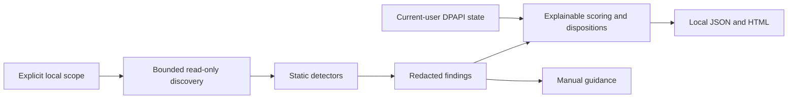

# AgentGuardian Personal v1 Architecture

This document defines the active architecture for version `0.2.0-beta.1`. The only active delivery and governance route is the unsigned `personal_exe_private_beta` track for known testers. Frozen candidate `8ad46e31486d05a2b4572ef8bd7442eb22a7b5b6` has current local-gate, GitHub CI, native unsigned-installer lifecycle, and independent-review evidence. It remains `PRIVATE-BETA-NOT-READY` because external license and Qt approval, two-machine acceptance, and operations/security readiness are pending; formal public release is `NO-GO`. Historical specs, plans, and reports do not extend this contract.

## Product boundary

Personal v1 supports Windows 11 x64 and the **personal non-regulated configuration** boundary. Users explicitly choose local directories and explicitly trigger each optional browser, clipboard, share-reachability, or fixed-remediation action.

Personal v1 permanently excludes MCP runtime integration. Enterprise features, a high-sensitivity mode, and dynamic MCP execution are permanently excluded. There is no telemetry, cloud console, automatic arbitrary remediation, or plugin execution.

OpenAI Provider support is limited to local adaptation, static detection, and manual guidance. The runtime must not call OpenAI or another provider API by default.

An Actions artifact from the public repository is not an access-controlled private distribution channel. `Private beta` describes maturity and the known-tester scope, not confidentiality.

## Current data flow



The main path runs as an ordinary user. Discovery reads only the selected scope. Reports are created only at a destination selected by the user and do not overwrite an existing file.

## Optional local reads

- Browser audit: after explicit confirmation, approved SQLite databases and required sidecars are copied read-only to a bounded temporary workspace. Only fixed metadata counts are retained; temporary copies are cleaned on success and failure.
- Clipboard audit: after explicit one-time confirmation, the current text is read in memory. Only redacted findings survive the call; source text is not written to reports or state.
- Report comparison: the user explicitly selects bounded local AgentGuardian JSON reports. Comparison retains aggregate results in memory and does not create a stable cross-scan finding identifier.

## Network boundary

Network access exists only in `share_verification.py` and only after the user explicitly supplies a public HTTP(S) URL. The action performs a bounded reachability read. It does not send scan files, findings, credentials, clipboard text, browser data, or reports. It does not classify the URL's contents, sharing permissions, or indexing safety.

No default path calls OpenAI or another provider API. The product has no telemetry, remote control plane, update service, or cloud synchronization.

## Static detection and remediation

`detectors.py` treats MCP configuration as local static data. A server that combines shell, filesystem-write, and network capabilities produces `MCP_DANGEROUS_COMBINATION`. This detector does not download or execute a server and does not prove that a configuration or endpoint is malicious.

`remediation.py` exposes one allowlisted repair for `OPENAI_BASE_URL_OVERRIDE`. It requires a redacted preview, explicit confirmation, target SHA-256 recheck, same-directory backup, atomic replacement, and conditional same-session rollback. It cannot run arbitrary commands, generate changes with an LLM, rotate credentials, or repair other findings automatically. Path checks and replacement still have a same-user race window.

## Protected local state

State is protected with current Windows user DPAPI and a SHA-256 integrity envelope. It contains fixed rule summaries, local references, dispositions, and bounded scan metadata. It does not contain raw matches, scan keys, full paths, or evidence source filenames. Only explicit save or disposition actions write state.

DPAPI does not protect against software already controlling the same Windows user session and does not support cross-user or cross-device recovery. Invalid state fails closed as `PROTECTED_STATE_INVALID`.

## Component contract

The JSON below mirrors the current `domain.py` dataclass field order.

<!-- domain-field-inventory -->
```json
{
  "Asset": ["asset_id", "kind", "display_name"],
  "Evidence": ["source", "fingerprint", "masked"],
  "Finding": [
    "rule_id",
    "domain",
    "severity",
    "root_fingerprint",
    "evidence",
    "disposition_ref"
  ],
  "Score": [
    "total",
    "deductions",
    "cap_reason",
    "coverage",
    "confidence",
    "limits",
    "incomplete"
  ],
  "RemediationPlan": [
    "rule_id",
    "asset_ref",
    "mode",
    "steps",
    "verification_steps"
  ],
  "VerificationResult": ["status", "notes"]
}
```

`Evidence.masked` is redacted display evidence. `Finding.disposition_ref` is a local protected-state reference and is not exported. `RemediationPlan` carries manual guidance; the fixed repair is a separate allowlisted workflow. `VerificationResult.status=not_performed` is not an acceptance result.

## Unsupported data and assurance limits

Medical, financial, identity or biometric, legally privileged, customer data, state-secret, other regulated, and other high-sensitivity real data are unsupported. This is a use boundary, not content-classification assurance.

Static source checks, local tests, candidate tooling, and retirement of the historical Store route do not establish production safety. The frozen candidate now has external evidence for scope, the local gate, remote checks, its exact unsigned installer lifecycle, and independent review. External license and Qt review, two-machine install/run/uninstall acceptance, and operations/security readiness remain pending. The status ledger cannot evidence its own commit; evidence must bind the frozen target candidate SHA externally. Even `PRIVATE-BETA-READY` would authorize only bounded testing by known testers, while formal public release remains `NO-GO`.
